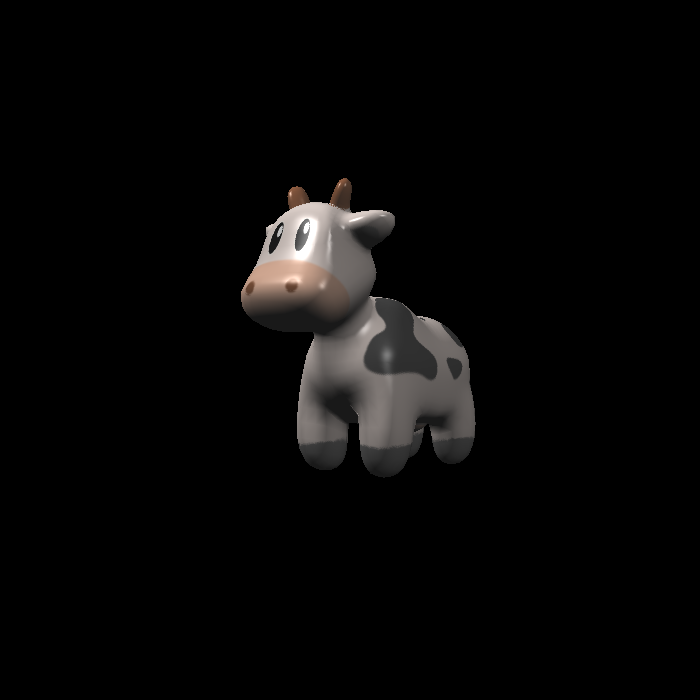
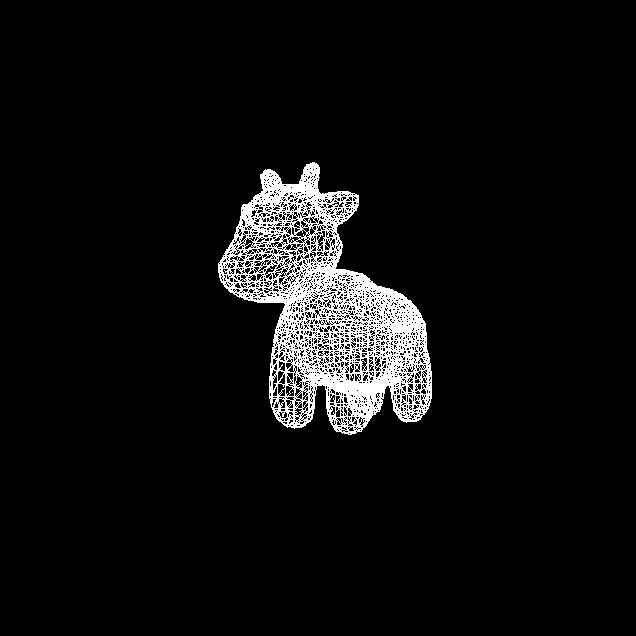

# RasterizerHowTo
A handwritten rasterizer with clean and well-annotated C++ implementation for systematic learning toward Computer Graphics.

## Supported Features
* Model, view, projection and viewport transformations.
* Wireframe rasterization.
* Mesh rasterization.
* Z-buffering algorithm.
* MSAA super-sampling anti-aliasing.
* Barycentric coordinates interpolation.
* Normal, Blinn-Phong, texture, bump and displacement mappings.

## Get Started
* From source
```bash
# more build details see `Development`
git clone https://github.com/dadadadawjb/RasterizerHowTo.git
cd RasterizerHowTo
mkdir build
cd build
cmake ..
make

# normal mapping
./RasterizerHowTo normal
# Blinn-Phong mapping
./RasterizerHowTo phong
# texture mapping
./RasterizerHowTo texture
# bump mapping
./RasterizerHowTo bump
# displacement mapping
./RasterizerHowTo displacement
```

* From release binary
```bash
# download from https://github.com/dadadadawjb/RasterizerHowTo/releases as `RasterizerHowTo`

# normal mapping
./RasterizerHowTo normal
# Blinn-Phong mapping
./RasterizerHowTo phong
# texture mapping
./RasterizerHowTo texture
# bump mapping
./RasterizerHowTo bump
# displacement mapping
./RasterizerHowTo displacement
```

## Results
* Wireframe Demo Rasterization


* Mesh Demo Rasterization


* Normal Mapping


* Blinn-Phong Mapping


* Texture Mapping



* Bump Mapping


* Displacement Mapping


* Wireframe Rasterization



## Development
At present, the use of `RasterizerHowTo` is somehow awkward.
The configurations are all set in `global.hpp`.
Specifically, `DEMO` determines whether to rasterize demo triangles or OBJ models, 
`OUTSIDE` determines whether to rasterize wireframe or not, 
`INSIDE` determines whether to rasterize area inside triangles or not, 
`MSAA` determines whether to use MSAA super-sampling anti-aliasing, 
`BILINEAR` determines whether to use bilinear interpolation to help shader.
Every time you changed, you should compile it again.

Another thing needed to notice is that, 
you need to set your path to `Eigen` inside `CMakeLists.txt`.
Also for easier experience, I do not ignore `.vscode` which provides C/C++ intellisense and build configuration, 
you need to set your path to `Eigen` and `OpenCV`.

## Note
The skeleton is taken from [GAMES101](https://sites.cs.ucsb.edu/~lingqi/teaching/games101.html) by [Lingqi Yan](https://sites.cs.ucsb.edu/~lingqi/).
